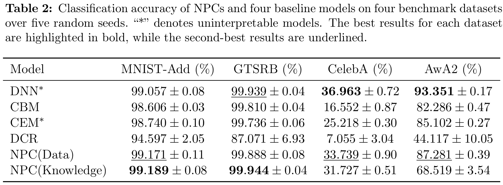
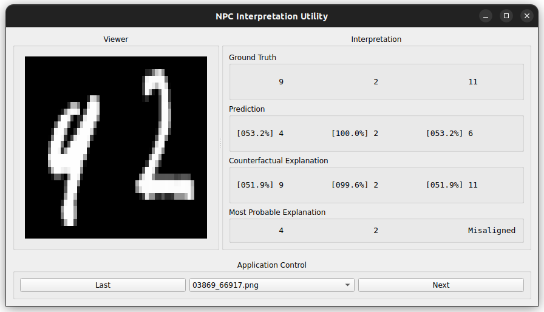

# Neural Probabilistic Circuit Models

## Table of Contents

1. [Project Overview](#project-overview)
1. [Project Hierarchy](#project-hierarchy)
1. [Project Prerequisites](#project-prerequisites)
1. [Getting Started](#getting-started)
1. [Training and Testing](#training-and-testing)
1. [Interpretability](#interpretability)
1. [Publications](#publications)
1. [Acknowledgements](#acknowledgements)
1. [License](#license)
1. [Contact](#contact)

## Project Overview

This codebase provides scripts and utilities for training, testing, and evaluating the models developed under the Neural Probabilistic Circuit (NPC) project.

The NPC pipeline follows a three-stage training algorithm:

1. **Neural Attribute Recognition**: trained through [Multi-Task Learning (MTL)](https://link.springer.com/article/10.1023/a:1007379606734) to predict attributes from input dataset.
2. **Probablistic Circuit (PC)**: constructed using data-driven or knowledge-injected approaches, and trained via the [Concave-Convex Procedure (CCCP)](https://proceedings.neurips.cc/paper/2016/hash/6c9882bbac1c7093bd25041881277658-Abstract.html) for parameter learning.
3. **Joint Optimization**: jointly optimize the independently trained Neural and PC models to form the final NPC pipeline.

Furthermore, a set of baseline models is trained, tested, and evaluated for comparison:

- [Residual Network (ResNet)](https://openaccess.thecvf.com/content_cvpr_2016/html/He_Deep_Residual_Learning_CVPR_2016_paper.html)
- [Attribute Bottleneck Model (ABM)](https://arxiv.org/abs/2501.07021)
- [Concept Bottleneck Model (CBM)](https://proceedings.mlr.press/v119/koh20a)
- [Concept Embedding Model (CEM)](https://proceedings.neurips.cc/paper_files/paper/2022/hash/867c06823281e506e8059f5c13a57f75-Abstract-Conference.html)
- [Deep Concept Reasoner (DCR)](https://proceedings.mlr.press/v202/barbiero23a.html)

The trained models are evaluated across four datasets, as detailed in the `npc-dataset-utils` project. The resulting NPC demonstrates strong performance compared to baseline models:



Beyond its excellent performance, the NPC is inherently interpretable by design. Two model explanation techniques are employed to analyze reasoning process of the NPC:

- [Most Probable Explanations (MPE)](https://ieeexplore.ieee.org/document/9363463)
- [Counterfactual Explanations (CE)](https://christophm.github.io/interpretable-ml-book/counterfactual.html)

The codebase includes the [NPC Interpretation Utility](#interpretability), which visualizes the generated MPEs and CEs for each instance, enabling easy comparson against both NPC predictions and ground truths.

Refer to the [NPC Paper](https://arxiv.org/abs/2501.07021) for complete details on the design, formulation, training, and evaluation of the NPC.

## Project Hierarchy

This project is part of the NPC pipeline. To ensure compatibility and maintain consistent references across the pipeline, organize the project directories as follows:

    npc
    ├── datasets
    ├── learnspn
    ├── npc-dataset-utils
    ├── npc-models
    └── venv

All subsequent instructions assume the above project hierarchy.

Before running this project, first ensure that all datasets are properly set up under `npc/datasets` by following the instructions in the `npc-dataset-utils` project. Then, construct and generate PCs for all datasets as described in the `learnspn` project instructions. Furthermore, review `header.py` and ensure that all relevant parameters are set to the desired values. More detailed instructions on certain parameters are provided in later sections.

## Project Prerequisites

This project requires the following system packages:

Ubuntu:

```bash
apt install libgl1-mesa-dev python3.10 python3-venv
```

Arch Linux:

```bash
yay -S mesa python310
```

This project was developed on Ubuntu and tested on both Ubuntu and Arch Linux. Other Linux distributions, macOS, or Windows Subsystem for Linux (WSL) may also work with additional setup. However, these platforms are not officially supported.

This project is designed to run within a simple Python virtual environment. Create and activate the environment as follows:

```bash
cd npc
deactivate
python3.10 -m venv venv
source venv/bin/activate
python3.10 -m pip install -r npc-models/requirements.txt
```

Always ensure the virtual environment is activated before running the project.

Ensure the graphics driver is installed. Additionally, for maximum compatibility and performance, run this project on a system with at least 64 GB of CPU memory (swap space acceptable) and 16 GB of GPU memory (aggregate across all available GPUs).

## Getting Started

Begin by setting the dataset prefix in `header.py` to specify the dataset to be used:

```python
dataset_prefix = "<dataset prefix>"
```

If applicable, enable Tensor Core acceleration on Ampere or newer GPUs:

```python
cuda_allow_tf32 = True
```

Optionally, set the log level to `trace` for more detailed output:

```python
log_level = type.LogLevel.trace
```

This project supports [Weights & Biases (wandb)](https://wandb.ai/) for experiment tracking and visualization. wandb logs key metrics such as model performance and loss, and automatically uploads model checkpoint files to cloud storage. To use wandb, log in with API key:

```bash
wandb login
```

Then, set run mode to `online` in `header.py`:

```python
run_mode = "online"
```

wandb is enabled only during training and is automatically disabled during testing.

## Training and Testing

For general setup and execution:
- Review and adjust additional parameters, such as training hyperparameters, if applicable, in the configuration dictionaries within `header.py`.
- Before joint optimization and testing, ensure that the dataset prefix in `header.py` matches the one specified in the run name or checkpoint file name passed as arguments.
- At the end of each training session, the training scripts automatically test the trained models. The identical test can be repeated manually by running the testing scripts and passing the training run names as arguments.

For checkpoint and run management:
- Each training session automatically generates a unique run name. Two checkpoint files containing model weights are produced during training, one updated every epoch and another updated only when validation performance improves, i.e., the _best_ checkpoint.
- Checkpoint files are stored under `npc-models/outputs/npc-models/checkpoints` and named using the generated run name. The best checkpoint file ends with `.best.zip`, as defined in `header.py`, and should be used for joint optimization and testing.
- If wandb is enabled, a wandb run is automatically created under the generated run name, and all checkpoints are uploaded to the wandb cloud storage.

For batch jobs and pretrained checkpoint files:
- Refer to the bash scripts in `npc/npc-models/script` for examples on batch training and testing, and the use of pretrained checkpoint files from the [NPC Paper](https://arxiv.org/abs/2501.07021) experiments.
- Pretrained checkpoint files from the [NPC Paper](https://arxiv.org/abs/2501.07021) experiments are not released by default. Contact [Simon Yu](mailto:simonyu@simonyu.net) to request access.

Detailed references for the training and testing commands are available in the following documents:

- [Command Reference for NPC Models](docs/npc-models/references/npc.md)
- [Command Reference for Baseline Models](docs/npc-models/references/baseline.md)

## Interpretability

### Model Explanations

The NPC is inherently interpretable by design. Two model explanation techniques are employed to analyze reasoning process of the NPC:

- [Most Probable Explanations (MPE)](https://ieeexplore.ieee.org/document/9363463)
- [Counterfactual Explanations (CE)](https://christophm.github.io/interpretable-ml-book/counterfactual.html)

The MPEs and CEs explains the model predictions by answering the follow questions, respectively:

- _Which specific combination of attributes most strongly supports the NPC’s prediction?_
- _Which specific combination of attributes would have corrected the NPC’s incorrect prediction?_

MPEs and CEs can be generated by `test_npc.py` during testing. To enable their generation, set the following parameter in `header.py`:

```python
npc_interpret = True
```

Refer to the [Command Reference for NPC Models](docs/npc-models/references/npc.md) for details on using `test_npc.py`.

The generated model explanations are stored as `npc/npc-models/outputs/npc-models/interpret/<dataset prefix>.json`.

### NPC Interpretation Utility

The NPC Interpretation Utility visualizes the generated MPEs and CEs for each instance, enabling easy comparson against both NPC predictions and ground truths.

The NPC Interpretation Utility provides an interactive, Qt-based graphical interface for visualizing the model explanations generated by `test_npc.py`. The utility enables intuitive comparison between the generated MPEs and CEs, the NPC’s predictions, and the corresponding ground truths for each instance. This comparison helps users qualitatively assess the interpretability and reasoning behavior of the NPC across datasets.

Key features of the utility include:

- A Viewer Panel that displays the currently selected instances.
- An Interpretation Panel that shows ground truths, NPC predictions, CEs, and MPEs. The rightmost column corresponds to the class label, while the remaining columns represent attributes. For MPEs, the rightmost column also indicates whether the explanation is _aligned_, as defined in the [NPC Paper](https://arxiv.org/abs/2501.07021).
- An Application Control Panel that allows users to navigate through instances sequentially using `Last` and `Next`, or directly access any instance via the drop-down menu.

Preview of the NPC Interpretation Utility:



To exclude correctly predicted instances from display in the NPC Interpretation Utility, set the following parameter in `header.py`:

```python
interpret_hide_correct = False
```

Additional parameters in `header.py` allow customization of the graphical interface, such as panel dimensions and font size.

Once configured, launch the utility with:

```bash
cd npc/npc-models/src/npc-models
./interpret.py
```

## Publications

Upon using this project, cite any relevant publications listed below:

### Neural Probabilistic Circuit (NPC)

```
@article{chen2025neural,
  title={Neural probabilistic circuits: Enabling compositional and interpretable predictions through logical reasoning},
  author={Chen, Weixin and Yu, Simon and Shao, Huajie and Sha, Lui and Zhao, Han},
  journal={arXiv preprint arXiv:2501.07021},
  year={2025}
}
```

```
@inproceedings{chenneural,
  title={Neural Probabilistic Circuits: An Overview},
  author={Chen, Weixin and Yu, Simon and Shao, Huajie and Sha, Lui and Zhao, Han},
  booktitle={Eighth Workshop on Tractable Probabilistic Modeling}
}
```

```
@article{caruana1997multitask,
  title={Multitask learning},
  author={Caruana, Rich},
  journal={Machine learning},
  volume={28},
  number={1},
  pages={41--75},
  year={1997},
  publisher={Springer}
}
```

### Probabilistic Circuit (PC)

```
@article{zhao2016unified,
  title={A unified approach for learning the parameters of sum-product networks},
  author={Zhao, Han and Poupart, Pascal and Gordon, Geoffrey J},
  journal={Advances in neural information processing systems},
  volume={29},
  year={2016}
}
```

```
@inproceedings{poon2011sum,
  title={Sum-product networks: A new deep architecture},
  author={Poon, Hoifung and Domingos, Pedro},
  booktitle={2011 IEEE International Conference on Computer Vision Workshops (ICCV Workshops)},
  pages={689--690},
  year={2011},
  organization={IEEE}
}
```

```
@article{sanchez2021sum,
  title={Sum-product networks: A survey},
  author={S{\'a}nchez-Cauce, Raquel and Paris, Iago and D{\'\i}ez, Francisco Javier},
  journal={IEEE Transactions on Pattern Analysis and Machine Intelligence},
  volume={44},
  number={7},
  pages={3821--3839},
  year={2021},
  publisher={IEEE}
}
```

### Residual Network (ResNet)

```
@inproceedings{he2016deep,
  title={Deep residual learning for image recognition},
  author={He, Kaiming and Zhang, Xiangyu and Ren, Shaoqing and Sun, Jian},
  booktitle={Proceedings of the IEEE conference on computer vision and pattern recognition},
  pages={770--778},
  year={2016}
}
```

### Concept Bottleneck Model (CBM)

```
@inproceedings{koh2020concept,
  title={Concept bottleneck models},
  author={Koh, Pang Wei and Nguyen, Thao and Tang, Yew Siang and Mussmann, Stephen and Pierson, Emma and Kim, Been and Liang, Percy},
  booktitle={International conference on machine learning},
  pages={5338--5348},
  year={2020},
  organization={PMLR}
}
```

### Concept Embedding Model (CEM)

```
@article{espinosa2022concept,
  title={Concept embedding models: Beyond the accuracy-explainability trade-off},
  author={Espinosa Zarlenga, Mateo and Barbiero, Pietro and Ciravegna, Gabriele and Marra, Giuseppe and Giannini, Francesco and Diligenti, Michelangelo and Shams, Zohreh and Precioso, Frederic and Melacci, Stefano and Weller, Adrian and others},
  journal={Advances in neural information processing systems},
  volume={35},
  pages={21400--21413},
  year={2022}
}
```

### Deep Concept Reasoner (DCR)

```
@inproceedings{barbiero2023interpretable,
  title={Interpretable neural-symbolic concept reasoning},
  author={Barbiero, Pietro and Ciravegna, Gabriele and Giannini, Francesco and Zarlenga, Mateo Espinosa and Magister, Lucie Charlotte and Tonda, Alberto and Li{\'o}, Pietro and Precioso, Frederic and Jamnik, Mateja and Marra, Giuseppe},
  booktitle={International Conference on Machine Learning},
  pages={1801--1825},
  year={2023},
  organization={PMLR}
}
```

## Acknowledgements

Special thanks to Rahim Khan, Tommy Tang, Alex Tanthiptham, and Trusha Vernekar for their contributions to the implementation, testing, and experiments involved in this project.

## License

This codebase is released under the [Creative Commons Attribution NonCommercial ShareAlike (CC BY-NC-SA)](https://creativecommons.org/licenses/by-nc-sa/4.0/deed.en) license, which can be viewed under `LICENSE`.

## Contact

For questions, feedback, or comments, open an issue or reach out to [Simon Yu](mailto:simonyu@simonyu.net).

Written by [Simon Yu](https://www.simonyu.net/).
